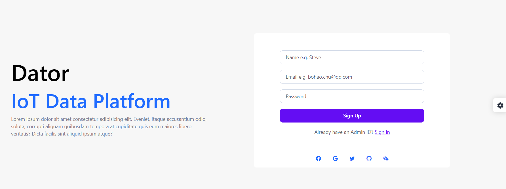

# Dator IoT Platform
## 项目简介

- **用于传感器数据分析的物联网平台**
- **支持多种协议接入**
- **支持自定义数据分析和可视乎**
- **基于ChatGPT,支持SDK代码生成**




## 推荐的IDE

- [VSCode](https://code.visualstudio.com/)
- [Volar](https://marketplace.visualstudio.com/items?itemName=johnsoncodehk.volar) (and disable Vetur) [VS插件]
- [TypeScript Vue Plugin (Volar)](https://marketplace.visualstudio.com/items?itemName=johnsoncodehk.vscode-typescript-vue-plugin) [VS插件]


## 项目启动

### 安装依赖

```sh
npm install
```

### 编译运行

```sh
npm run dev
```

